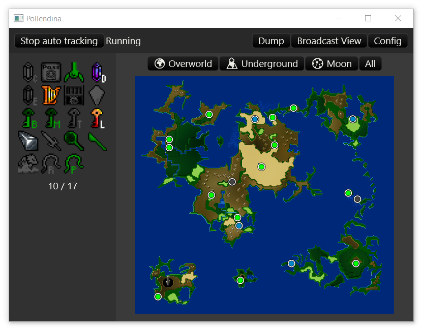

# Pollendina

Pollendina is a randomizer tracker that runs as a native app on your
computer. It is heavily inspired by the amazing [EmoTracker](https://emotracker.net/)

**_Pollendina is in it's early stages and under HEAVY, ACTIVE DEVELOPMENT!_**

**_The user interface is likely to change throughout the alpha releases!_**

Pollendina's notable features are:

- Supports **Windows** and **MacOS**.
- Supports **auto tracking** using [usb2snes](http://usb2snes.com/) and
  [QUsb2snes](https://skarsnik.github.io/QUsb2snes/)
- Dynamic map and objective support.
- Game support is added through an **extensible module system**.
- Comes bundled with [Free Enterprise](http://ff4fe.com) module.

Planned features:

- Support for Linux.
- Modules for randomizers other than Free Enterprise.
- Developer documentation.

Planned Free Enterprise features:

- Flag string parsing.
- Automatic flag string detection from the auto-tracker.
- Objective support.

For information on how to use Pollendina, please read the
[Docs](https://konkers.github.io/pollendina/)
