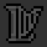
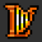
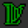

# Key Item View

The Key Item View displays all the key items in the game. Key Items in this view
have 3 states. Each state has a distinct appearance.

- 
  **Locked**: Key item has not been found.
- 
  **Unlocked**: Key item has been found.
- 
  **Complete**: Key item has used.

Clicking on a key item will change its state from **locked**, to **unlocked**, to
**complete**, and back to **locked** again. If auto tracking is active, it will
override key items that are auto tracked.
