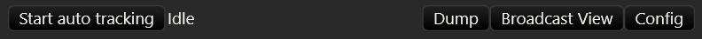

# Action Bar

The Action Bar is where all the non-game related actions live. Almost no
work has been spend on its UI so expect it to change in the future. The
actions are:

- **Start/Stop auto tracking** starts and stops the auto tracker. See the
  [Auto Tracking](./04_auto_tracking.md) Chapter for more information.
- **Dump** dumps application state to the console. This is not useful
  unless you are running the app from the command line.
- **Broadcast View** opens the broadcast view window. See the
  [Broadcast View Window](./03_05_quick_start_broadcast_window.md) section for more information
- **Config** opens the config window. See the [Config Window](./03_04_quick_start_config_window.md)
  section for more information.
