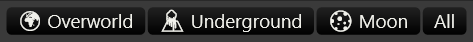

# Map View

The Map View shows all the location in the game on the game's maps. There are multiple
map views which can be selected by clicking on one of the buttons:

Each location is represented by a colored circle. The circles color indicates a the
availability of checks at that location:

-  No checks available. Even if some checks are
  complete, the location will be in this state if there are some checks that are
  not yet available.
-  At least one check is available.
-  All checks have been completed.
-  If there are no checks at the locations
  because all its checks have been disabled by flags, it will not appear on the
  map.

Clicking one of the location circles will bring up the checks pop-up listing all
the checks at that location and their states. The checks are color coded
using the same scheme described in the [Key Item View](./03_02_quick_start_key_item_view.md) section.
Clicking outside the popup will close it.
