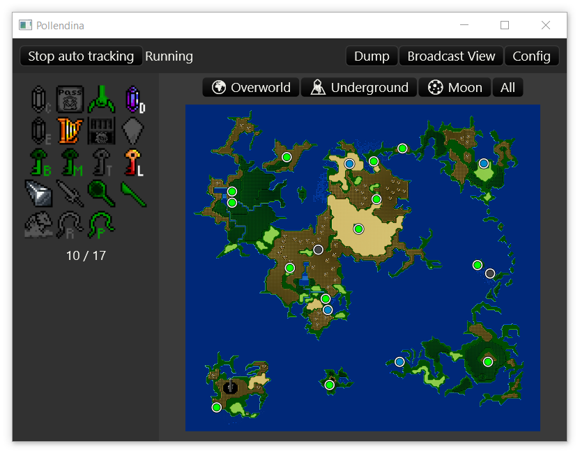

# Quick Start

## Main Window

The main window is divided into tree sections:

1. [**Action Bar**](./03_01_quick_start_action_bar.md) at the top of the window.
2. [**Key Item View**](./03_02_quick_start_key_item_view.md) at the left of the window.
3. [**Map View**](./03_03_quick_start_map_view.md) at the right of the window.

In addition the main window, there are two additional windows:

1. [**Config Window**](./03_04_quick_start_config_window.md)
2. [**Broadcast View Window**](./03_05_quick_start_broadcast_window.md)
